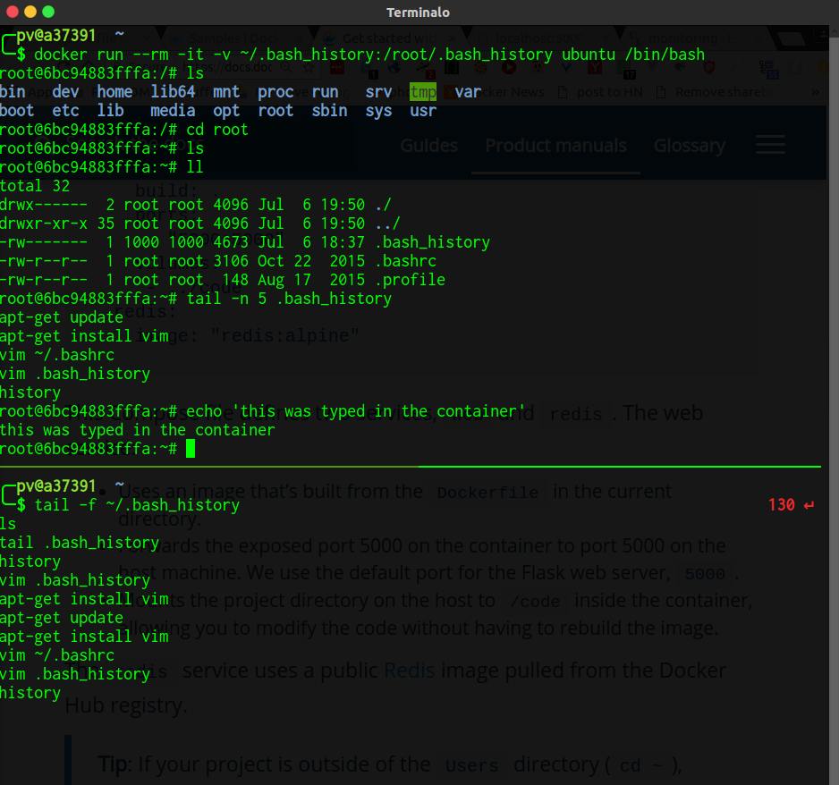
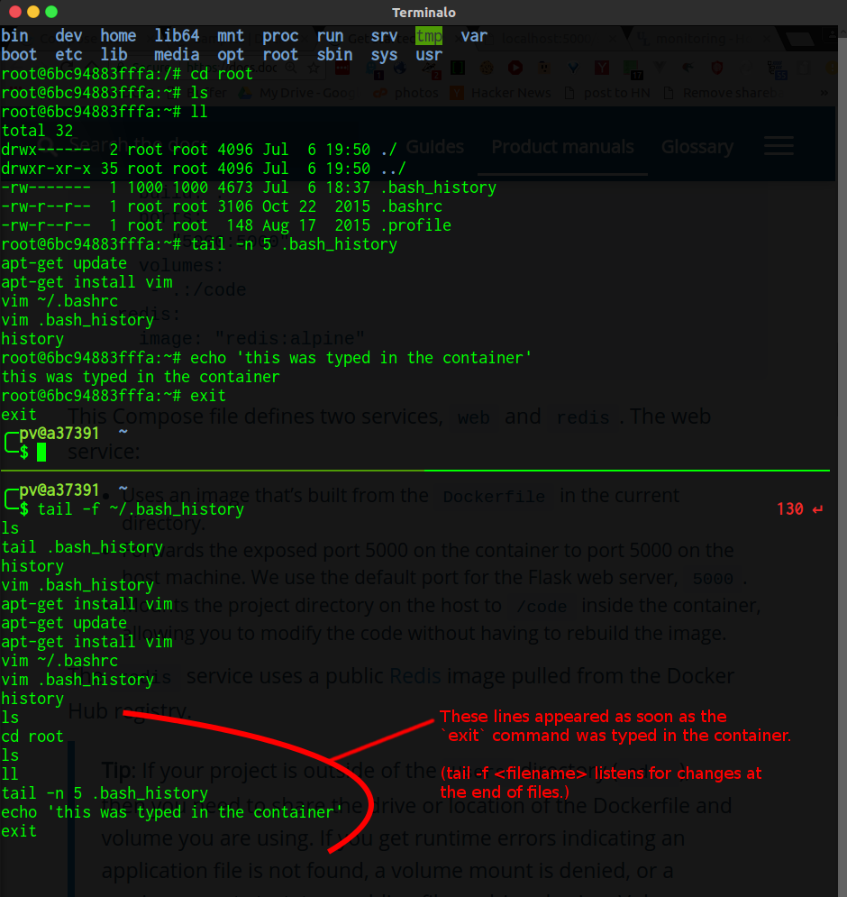

From [here](https://docs.docker.com/engine/tutorials/dockervolumes/#mount-a-host-file-as-a-data-volume):

    $ docker run --rm -it -v ~/.bash_history:/root/.bash_history ubuntu /bin/bash

It will copy your host's `.bash_history` to the container. When the container exits, the commands that were typed in the container's `bash` will be in the host's `~/.bash_history` file.

